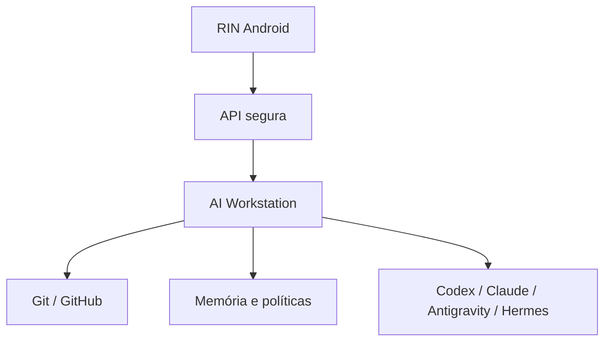

# RIN

RIN é o aplicativo Android da [AI Workstation](https://github.com/playertwo1/aiworkstation). Ele é o painel móvel pessoal de Rafael para acompanhar, decidir e autorizar o trabalho realizado pela plataforma no computador.

O **Projeto Vivo** é o primeiro módulo do RIN. Ele responde:

- Onde parei?
- O que mudou?
- O que falta?
- Qual agente está trabalhando?
- O que precisa da minha decisão?

## Fronteira do produto

| Componente | Responsabilidade |
|---|---|
| RIN | Aplicativo Android, experiência móvel, cache offline, notificações, decisões e aprovações |
| Projeto Vivo | Módulo do RIN para projetos, checkpoints, bugs, decisões, próximos passos e handoffs |
| AI Workstation | Plataforma no Galaxy Book/PC: API, execução, memória canônica, Git/GitHub, agentes, políticas e automações |

O RIN **não possui um backend independente**. O antigo conceito “RIN Server” passa a ser a API/nó de execução da AI Workstation.

## Funções do RIN

- Home com projetos, agentes, workstation e decisões pendentes.
- Módulo Projeto Vivo com “Onde parei?” e histórico.
- Visualização de tarefas, bugs, testes, bloqueios e evidências.
- Acompanhamento de sessões e eventos.
- AI Shift para preparar e aprovar handoffs entre agentes.
- Aprovação ou rejeição de ações sensíveis.
- Notificações de conclusão, falha, limite e decisão pendente.
- Operação offline com sincronização posterior.

## Arquitetura

Git é a fonte da verdade do código. A AI Workstation mantém o estado operacional e os contratos. O RIN conserva apenas os dados necessários para a experiência móvel e uso offline.

## Estado atual

Implementação não iniciada. O plano até 1.0 está dividido em **19 fases e 76 tarefas**, com critérios de aceite e evidências. O primeiro caminho vertical deve provar RIN Android → API simulada da AI Workstation → lista de projetos. Integração real e piloto são gates separados.

Para iniciar no Antigravity, use [START_HERE](docs/execution/START_HERE.md). A primeira tarefa é **F00-T01**. Os guardrails do Google Drive estão incorporados em [AI_PROJECT_GUARDRAILS](AI_PROJECT_GUARDRAILS/README.md).

## Documentação

- [Roadmap](ROADMAP.md)
- [Estado atual](PROJECT_STATE.md)
- [Arquitetura](docs/ARCHITECTURE.md)
- [Decisões](docs/DECISIONS.md)
- [Contrato com a AI Workstation](docs/INTEGRATION_CONTRACT.md)
- [Conversa original](docs/CONVERSA_CONSOLIDADA.md)
- [Especificação original em DOCX](docs/RIN_Especificacao_e_Roadmap_Inicial.docx)
- [Instruções para agentes](AGENTS.md)
- [Protocolo de execução](docs/execution/PROTOCOL.md)
- [Guia técnico e estrutura prevista](docs/planning/IMPLEMENTATION.md)
- [Requisitos e dependências](docs/planning/REQUIREMENTS.md)
- [Dependências da AI Workstation](docs/planning/EXTERNAL_DEPENDENCIES.md)
- [Qualidade e evidência](docs/quality/VALIDATION.md)
- [Critérios da versão 1.0](docs/quality/RELEASE_1_0.md)
- [Origem e divergências da documentação](docs/planning/SOURCES.md)

> A conversa e o DOCX preservam a origem do projeto, mas podem conter o termo histórico “RIN Server”. Para implementação, prevalecem README, ROADMAP, ARCHITECTURE, DECISIONS e INTEGRATION_CONTRACT.

## Restrições

- Sem terminal genérico no Android.
- Sem execução de agentes dentro do celular.
- Sem contorno de cotas ou termos de uso.
- Sem ação destrutiva sem política e aprovação.
- Sem progresso inventado; apenas estados confirmados.
- Sem formatos internos de provedores na camada de UI.

## Licença

A licença será definida antes da primeira distribuição pública.
