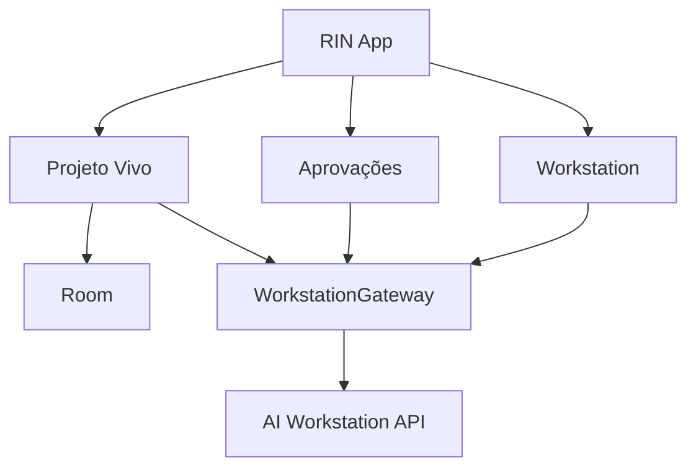

# Arquitetura do RIN

## Papel arquitetural

O RIN é o **Control Plane Android** da AI Workstation. Ele apresenta estado, permite registrar informações locais e envia intenções autorizadas. Processamento pesado, Git local, agentes, memória canônica, políticas e execução pertencem ao repositório `playertwo1/aiworkstation`.

## Componentes do aplicativo

- Kotlin, Jetpack Compose e Material 3.
- MVVM com camadas de interface, domínio e dados.
- Room para cache offline e dados locais do usuário.
- WorkManager para sincronização e notificações adiáveis.
- HTTPS para consultas/comandos tipados.
- WebSocket ou SSE para eventos, após decisão no contrato.
- Android Keystore para chaves do dispositivo.
- `WorkstationGateway` como única fronteira de rede.

## Módulos

## Responsabilidade dos dados

| Dado | Autoridade |
|---|---|
| Preferências e rascunhos locais | RIN/Room |
| Cache e cursor de sincronização | RIN/Room |
| Código e commits | Git/GitHub |
| Sessões, eventos e execução | AI Workstation |
| Memória canônica do projeto | AI Workstation |
| Aprovação efetivada e auditoria | AI Workstation |
| Estado visual offline | RIN, marcado com data e condição de sincronização |

## Fluxo de comando

1. RIN cria uma intenção tipada com chave de idempotência.
2. `WorkstationGateway` envia à API da AI Workstation.
3. A plataforma autentica o dispositivo e avalia a política.
4. A plataforma persiste a transição antes de responder/publicar o evento.
5. RIN atualiza o cache e mostra estado confirmado, pendente ou falho.
6. Após desconexão, o app recupera eventos pelo cursor.
7. Sucesso exige evidência da plataforma, nunca apenas aceitação em fila.

## Limites

- Nenhum endpoint ou tela de shell genérico.
- Nenhuma integração direta da UI com Codex, Claude, Antigravity ou Hermes.
- Nenhum token de provedor no app.
- Nenhuma regra de orquestração duplicada.
- Nenhuma ação sensível sem prévia compreensível, expiração e confirmação.
- Nenhuma porcentagem de progresso inferida sem fonte real.

## Guia de implementação e evolução

O detalhamento de módulos, autoridade local/remota, transações de sync, outbox,
segurança e isolamento de fakes está em [IMPLEMENTATION](planning/IMPLEMENTATION.md).
Esses componentes são previstos; ainda não existem na base documental.
As fases e provas estão em [ROADMAP](../ROADMAP.md), com início em F00.
