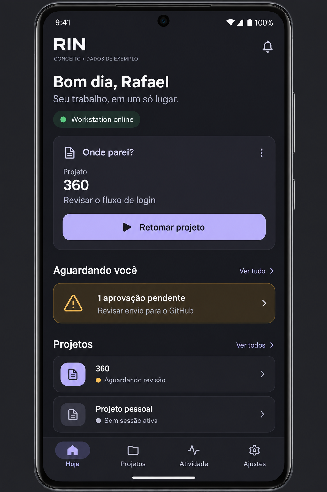
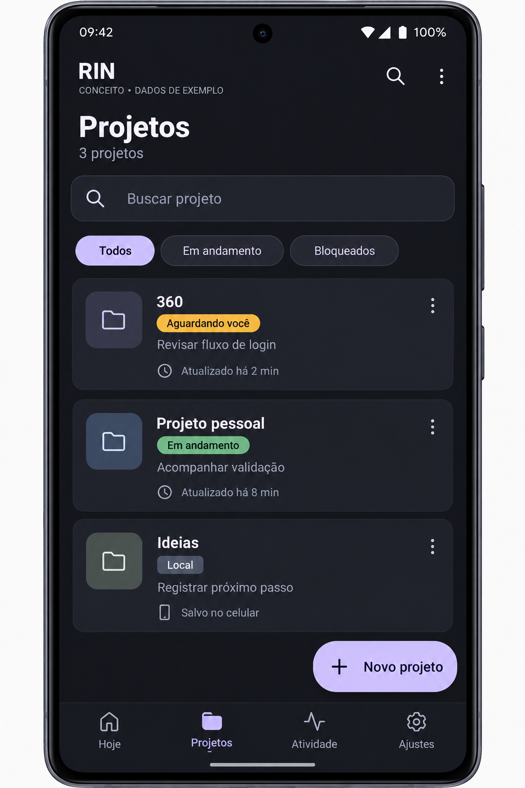
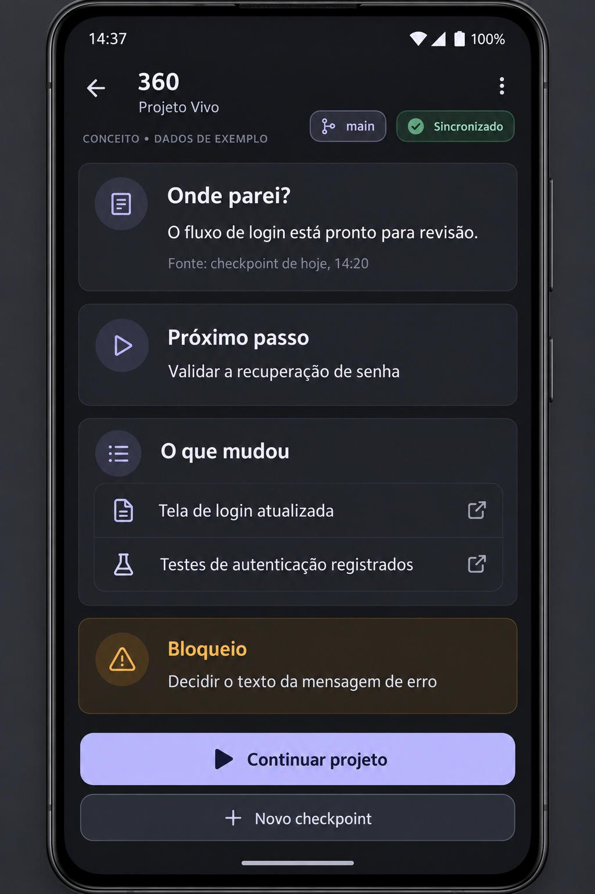
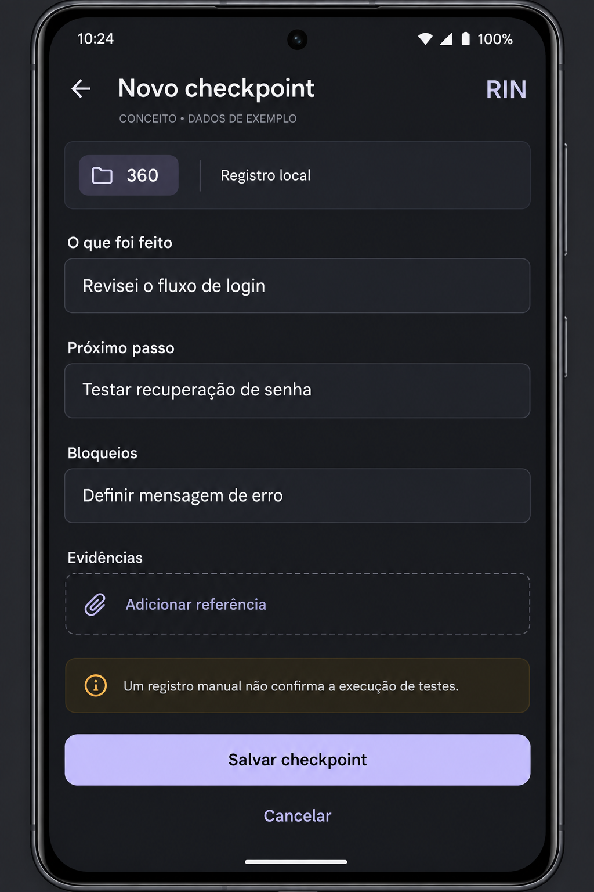
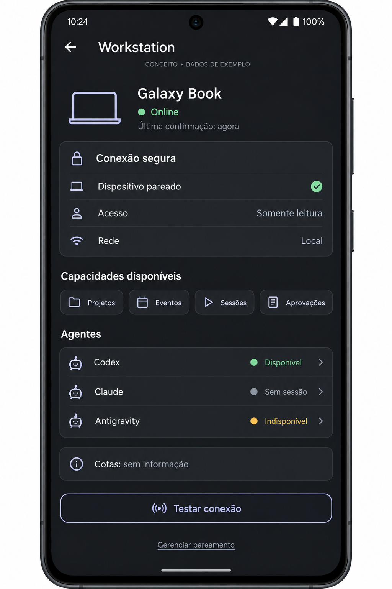
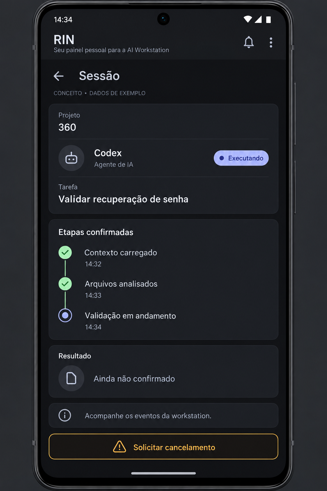
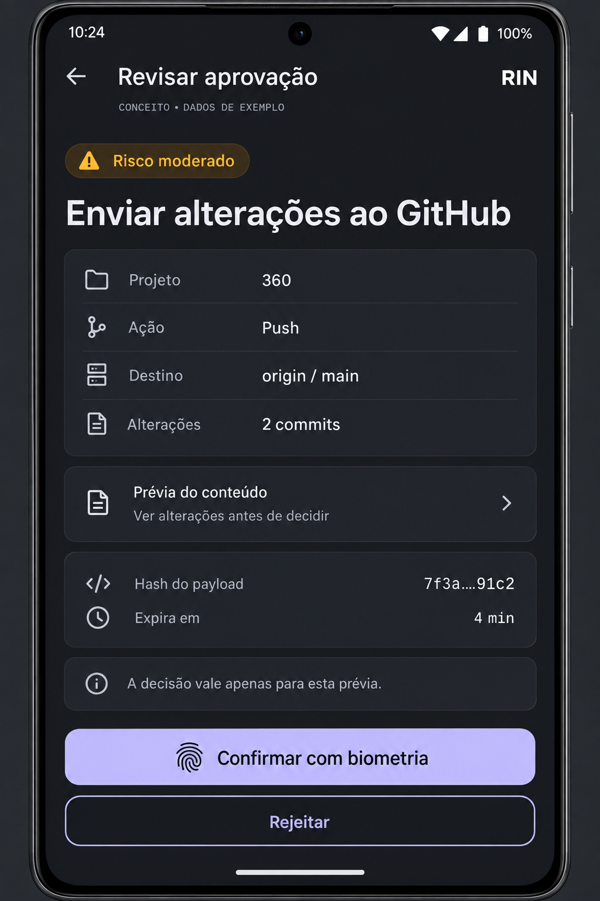
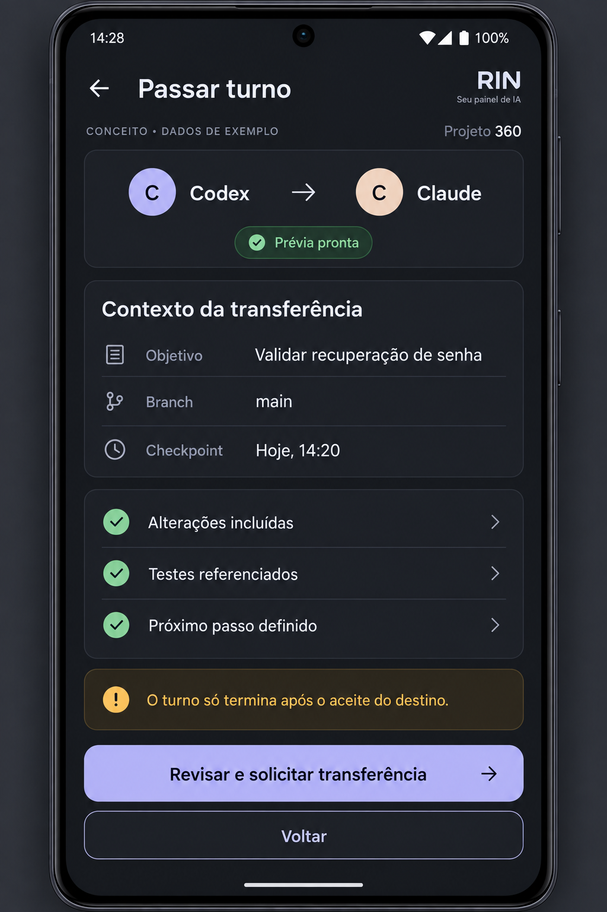
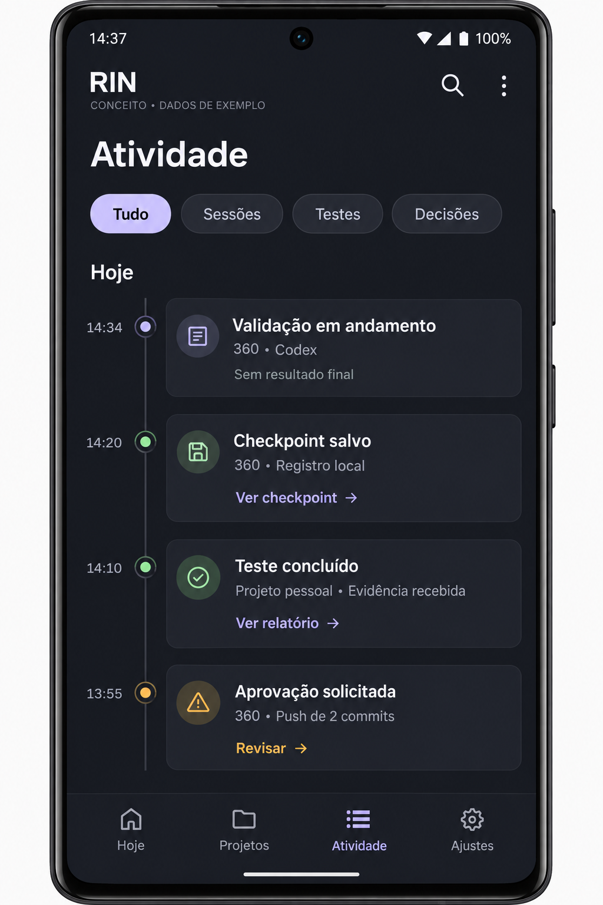
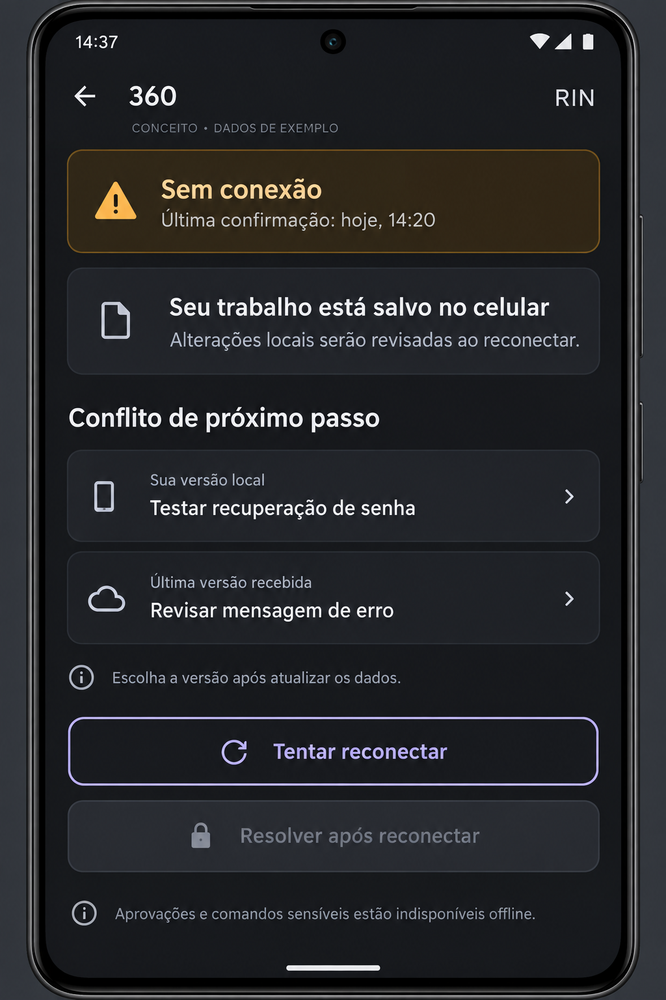

# RIN — dez propostas de tela

Mockups gerados em 2026-09-13 pelo gerador de imagens integrado.
Proposta visual em tema escuro; dados sintéticos. Ainda não aprovada como design definitivo.
Estas imagens não são capturas de app funcional nem comprovam integrações ou resultados reais.

[Prompts utilizados](PROMPTS.md) · [Roadmap do produto](../../../ROADMAP.md)

## 01 — Home — visão do dia

## 02 — Lista de projetos

## 03 — Projeto Vivo — onde parei

## 04 — Novo checkpoint

## 05 — Conexão com a workstation

## 06 — Sessão em andamento

## 07 — Revisão de aprovação

## 08 — AI Shift — passar turno

## 09 — Atividade e evidências

## 10 — Modo offline e conflito

## Orientação para implementação

Use como referência visual proposta. O contrato, o roadmap e os guardrails continuam prevalecendo.
A presença de nomes de agentes, estados, métricas ou referências exemplifica layout; não comprova capacidades.
O rótulo CONCEITO identifica este material de apresentação e não é texto obrigatório na interface real.
A tela de conexão ilustra acesso somente leitura; a aprovação ilustra outro cenário com autorização apropriada.
Margens externas, molduras e horários variam entre as imagens e não são especificações de layout pixel a pixel.
